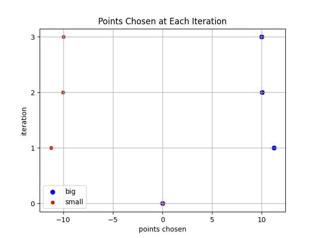
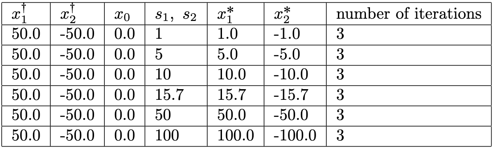

We consider a slightly more sophisticated cognitive model than simply taking the average of Big and Small. Our victim has become more rational; it does not want to accept information that is too extreme or biased. Moreover, it also has its own idea before the game starts, which is represented by $ x_{0} $. Let us also transform the dicrete space of [Influencer War 0](https://yan-cheng-1113.github.io/yan-cheng-1113-github.io/post/inf_war_0/) into a continuous one.

Given reports $ x_{b} $ and $ x_{s} $ from Big and Small, the victim chooses $ \sigma_{g} $ and $ \sigma_{s} $, then it calculates $$ g_{b}=e^{-\frac{(x_{b}-x_{0})^{2}}{2\sigma^{2}_{b}}} \\ g_{s}=e^{-\frac{(x_{s}-x_{0})^{2}}{2\sigma^{2}_{s}}} $$ Here, $ g_{b} $ and $ g_{s} $ represent "how much the victim trusts Big and Small based on the articles they picked". The victim updates its opinion by calculating $$ v=\frac{x_{0}+x_{b}\cdot g_{b} + x_{s}\cdot g_{s}}{1+g_{b}+g_{s}} $$

We ran best-response dynamics using the 1-d verison of the game. Here we showcase one of the games:
<figure>
  
  <figcaption>Game development with victim's prior at 0, B at 50, S at -50, and SD=10 for both players.</figcaption>
</figure>
The game converges at Big choosing $ 10 $ and Small choosing $ -10 $, suggesting that the converging points of the game seem to be closely related to the standard deviation $ \sigma $. We fixed other parameters and ran more best-response simulations with different $ \sigma $, here are the results :
<figure>
  
</figure>
In the table, $ x^{\dagger}_{1} $ and $ x^{\dagger}_{2} $ represent $ B $ and $ S $, respectively. $ s_{1} $ is $ \sigma_{b} $ and $ s_{2} $ is $ \sigma_{s} $. We can observe that when the same standard deviation is applied, the convergence of the game is dominated by this value.

It is not yet clear whether the game under this setting, when extended to $ n $ players, is still a potential game. 
