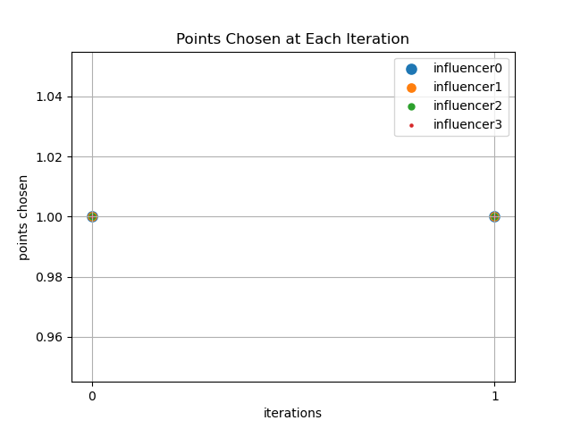
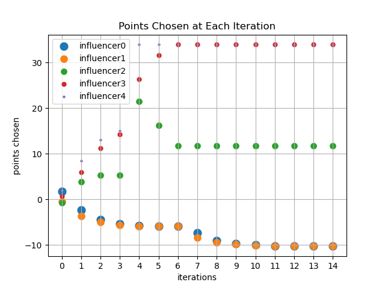

Let us revisit the naive model where the victim simply takes the average of influencers' reports and give it a small upgrade. This time, we include $ n $ influcencers with targets $ t_{1}, ..., t_{n} $. These targets are common knowledge. At the beginning of the game, influencer $ i $ will draw a sample $ z_{i} $, which is private to itself, from a probability distribution $ N(\mu, \sigma^{2}) $ given by the environment. The victim, after collecting all the reports, generate opinion $ v = f(x_{1:n}, t_{1:n}) $. And influencer $ i $ incurs loss $ (v-t_{i})^{2} $.

The victim does not want to receive any biased reports. Hence, it decides to use the following $ f $: $$ f(x_{1:n}, t_{1:n})=\hat{x} + \left(\hat{x}_{-i^\star} - x_{i^\star}\right)^\top \dfrac{\hat{x}_{-i^\star} - t_{i^\star}}{\left\|\hat{x}_{-i^\star} - t_{i^\star}\right\|} \dfrac{\hat{x}_{-i^\star} - x_{i^\star}}{\left\|\hat{x}_{-i^\star} - x_{i^\star}\right\|} \varepsilon $$
Where, $$ i^\star = \argmax_{i} \left(\hat{x}_{-i} - x_{i}\right)^\top \dfrac{\hat{x}_{-i} - t_{i}}{\left\|\hat{x}_{-i} - t_{i}\right\|} $$
And $ \hat{x} $ represents the average of all reports; $ \hat{x}_{-i} $ represents the average of all reports excluding $ x_{i} $.

Here, $ i^\star $ denotes the biggest "cheater" in the game, which is the agent that deviates the most from its peers in a direction that is favorable to itself. This particular $ f $ excludes the biggest "cheating" influncer's report and moves $ v $ in the direction that harms the interest of this cheating agent. 

In this game, when $ \varepsilon > \frac{1}{n} $, influencers can reach a strict Nash Equilibrium by reporting the same point. The game can also converge at a state where influencers try to cheat, but not that much so that they do not become the biggest cheater. Here are some examples of agents' behaviors under BRD:
<figure>
  
  <figcaption>The game with N(1,0) as the distribution</figcaption>
</figure>

<figure>
  
  <figcaption>The game with N(1,1) as the distribution and agents have targets at -30, -10, 5, 20, 40</figcaption>
</figure>